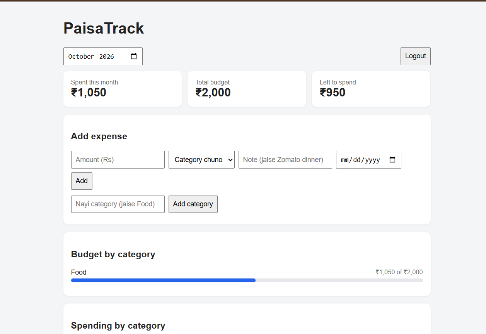

# PaisaTrack

A personal expense and budget manager: a REST API backend built with FastAPI, with a small web dashboard.



## Features
- Register and log in with JWT tokens (passwords hashed with bcrypt)
- Create categories, add, edit and delete expenses, filter by month or category
- Set monthly budgets per category and get ok, warning or exceeded status
- Monthly summary and category-wise spending reports
- Every user sees only their own data
- Web dashboard (HTML, CSS, JavaScript) served by the same FastAPI app

## Tech stack
Python, FastAPI, SQLAlchemy, SQLite, JWT (PyJWT), bcrypt, pytest

## Design decisions
- Money is stored as integer paise, not floats, to avoid rounding errors
- Every query is filtered by the logged-in user's id, so one user can never read or change another user's data
- Monthly totals use SQL GROUP BY and JOIN instead of looping in Python
- Login returns the same error for a wrong email or a wrong password

## API overview
| Method | Endpoint | What it does |
|--------|----------|--------------|
| POST | /register | Create an account |
| POST | /login | Get a JWT token |
| GET | /me | Current user |
| POST, GET | /categories | Create or list categories |
| POST, GET | /expenses | Add or list expenses (month, category_id filters) |
| PUT, DELETE | /expenses/{id} | Edit or delete an expense |
| POST | /budgets | Set a monthly budget for a category |
| GET | /budgets/status | Spent, remaining and status per budget |
| GET | /reports/summary | Monthly total spent, budget and remaining |
| GET | /reports/by-category | Category-wise totals with percentages |

Interactive API docs are available at /docs.

## Run locally
```
python -m venv venv
venv\Scripts\activate
pip install -r requirements.txt
uvicorn app.main:app --reload
```
Open http://localhost:8000 for the dashboard or http://localhost:8000/docs for the API docs.

## Run tests
```
pytest
```

## Next steps
- Deploy online with PostgreSQL
- Database migrations with Alembic
- Edit and delete from the dashboard